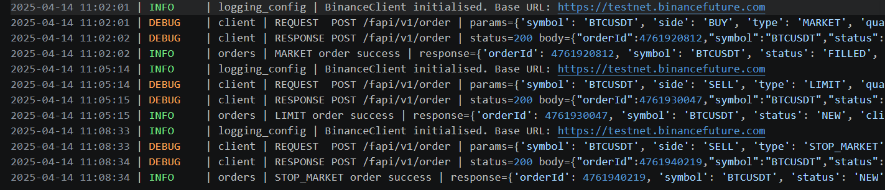
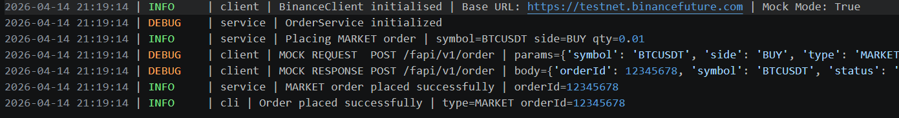

# Modular Trading System CLI (Binance Futures Testnet)

A fault-tolerant Python trading system with retry logic, structured logging, and mock-first architecture.

## Why This Project?

This project demonstrates how real-world backend systems handle unreliable external APIs.

Trading systems require strict validation, retry mechanisms, structured logging, and clear error handling to operate reliably under network failures and API constraints. This project models those patterns in a simplified but production-oriented design.

## Tech Stack

- Python
- `argparse`
- `requests`
- `logging`
- `python-dotenv`

## Engineering Highlights

- Implemented retry logic with exponential backoff to handle transient failures  
- Designed a mock-first architecture to enable offline development and testing  
- Built a layered system (CLI → Service → Client) for separation of concerns  
- Added structured logging for observability and debugging  
- Enforced strict input validation before API interaction  

## Architecture

```text
CLI (cli.py)
  -> OrderService (service.py)
  -> BinanceClient (client.py)
  -> Binance Futures Testnet API
```

I used this structure so the code stays simple and each file has one job. The CLI handles user input, the service layer handles order flow, and the client handles API calls. That makes the project easier to test and easier to change later.
This layered design improves maintainability, testability, and resilience, which are critical in real-world backend systems.

## Project Structure

```text
trading_bot/
├── cli.py
├── bot/
│   ├── client.py
│   ├── service.py
│   ├── validators.py
│   ├── orders.py
│   └── logging_config.py
├── logs/
├── requirements.txt
└── README.md
```

### File Summary

- `cli.py`: command line entry point
- `bot/service.py`: order service layer
- `bot/client.py`: Binance request client with retry, timeout, and mock mode
- `bot/validators.py`: input checks for symbol, side, type, quantity, and price
- `bot/logging_config.py`: file and console logging setup
- `bot/orders.py`: formatting helpers for order output

## Setup

```bash
git clone <repository-url>
cd trading_bot
python -m venv trade_bot
trade_bot\Scripts\activate
pip install -r requirements.txt
```

Create a `.env` file in the project root:

```env
BINANCE_API_KEY=your_testnet_api_key
BINANCE_API_SECRET=your_testnet_api_secret
BASE_URL=https://testnet.binancefuture.com
USE_MOCK=false
```

Notes:
- `USE_MOCK=true` keeps the bot offline and returns fake but realistic responses
- Set `USE_MOCK=false` to call the real Binance Futures Testnet API
- This project uses Binance Futures Testnet only, so no real money is involved

## Usage

Market order:

```bash
python cli.py place --symbol BTCUSDT --side BUY --type MARKET --quantity 0.01
```

Limit order:

```bash
python cli.py place --symbol ETHUSDT --side SELL --type LIMIT --quantity 0.5 --price 3500
```

Stop market order:

```bash
python cli.py place --symbol BNBUSDT --side BUY --type STOP_MARKET --quantity 1 --price 400
```

Balance check:

```bash
python cli.py balance
```

Help:

```bash
python cli.py --help
python cli.py place --help
```

## Sample Output

```text
=== ORDER SUMMARY ===
Symbol: BTCUSDT
Side: BUY
Type: MARKET
Quantity: 0.01

=== RESPONSE ===
Order ID: 123456
Status: FILLED
Executed Qty: 0.01
Avg Price: 65000
```

## Production Considerations

- External APIs are unreliable, so retry logic and timeouts are essential  
- Logging is critical for debugging failures in distributed systems  
- Input validation prevents invalid requests from reaching the API  
- Mock mode allows safe testing without relying on external services  

## Logging

Logs are written to the `logs/` directory with one file per day.

Each log entry includes:
- Request details (excluding sensitive data)
- Response status and payload
- Execution time
- Errors and retry attempts

## Sample Logs (Assets)

Sample log snapshots are stored in the `assets/` folder for quick review:




You can use these screenshots to show request/response flow, retry attempts, and error traces without opening the raw `.log` files.

## Mock Mode

Set `USE_MOCK=true` to skip Binance API calls and return mock responses. I added this because testnet APIs can be slow or unavailable, and it makes it easier to test the CLI without real credentials.

## Error Handling

- Validation errors are caught before any API request is made
- API errors are returned as readable messages
- Network calls use retry logic with exponential backoff
- Requests time out after 5 seconds

## Assumptions

- The bot is for Binance Futures Testnet (USDT-M)
- No real funds are used
- The project is intentionally kept small and simple

## Future Improvements

- Add unit tests for validators and client methods
- Add a small web dashboard
- Add real-time price data support
- Add more order management commands
